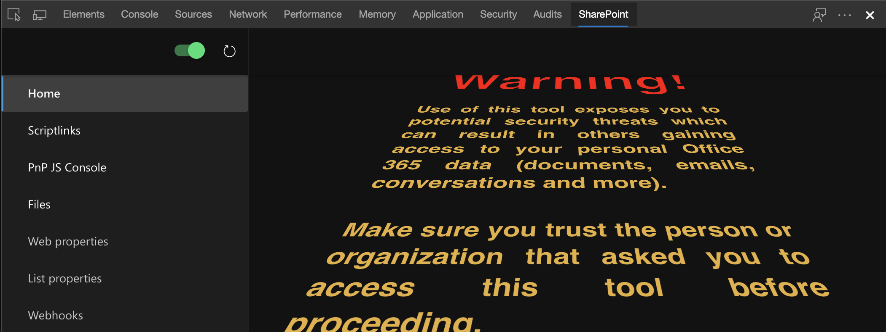
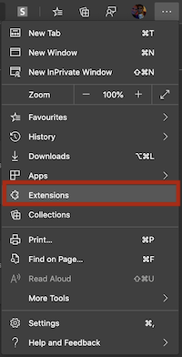
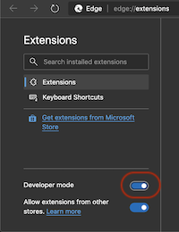
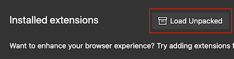
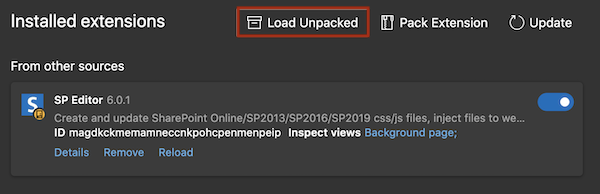
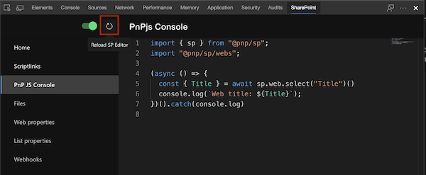
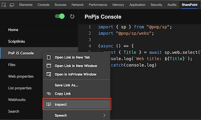

# SP Editor
SP Editor is a developer tool extension for SharePoint available on [Chrome](https://chrome.google.com/webstore/detail/sp-editor/ecblfcmjnbbgaojblcpmjoamegpbodhd) and [Microsoft Edge](https://microsoftedge.microsoft.com/addons/detail/sp-editor/affnnhcbfmcbbdlcadgkdbfafigmjdkk).



If you want to chip in by porting features or even creating new ones, here is a guide how to get started contributing.

### Running locally with watch mode
```powershell
git clone https://github.com/pnp/sp-editor.git # clone the project
cd sp-editor # go to the folder
code . # open vscode
npm i # install dependencies
npm run build # to build everything before starting to developing
npm start # build and start watch mode
```
When Watch is running, open Microsoft Edge and select Extensions from the menu



Enable Developer Mode



Load Unpacked Extension, select the **build** folder of the project



If all good, the local build extension will show up



Now you can open a SharePoint site, open devtools and select SharePoint tab. The extension updates it self on file changes. If it does not, press the reload button to reload extension after making code changes.



To inspect the Extension, you can open the extension devtool by right clicking and selecting **Inspect** and you can see the dom/console/sources/etc of the extension.



### AI Assistant (optional)

The AI Assistant feature requires the native messaging bridge and [GitHub Copilot CLI](https://www.npmjs.com/package/@github/copilot) installed locally.

```bash
# 1. Install and authenticate Copilot CLI
npm install -g @github/copilot
copilot login

# 2. Install the SP Editor native bridge
npm install -g @sp-editor/native-bridge
sp-editor-bridge install
```

After running `sp-editor-bridge install`, reload the extension in the browser and the AI Assistant panel will be able to connect.
